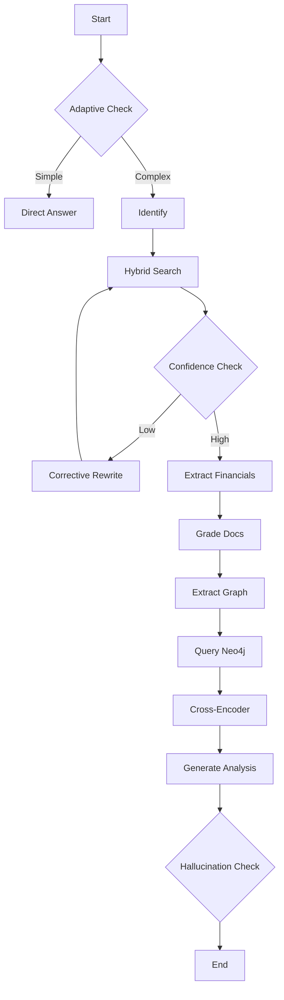

# Ultimate GraphRAG Business Analyst (v28.1)

**Current Version:** 28.1 (SOTA Reasoning + Precision)

## Overview
The **Ultimate GraphRAG Business Analyst** is the most advanced agent in this suite, designed for deep strategic and financial analysis of 10-K filings. It combines **Knowledge Graph** reasoning (Neo4j) with **Structured Financial Extraction** (XBRL simulation) to deliver answers that are both strategically insightful and numerically precise.

## 🚀 Key Features (v28.1)

### 1. 💰 Structured Financial Extraction (New in v28.1)
- **Regex/XBRL Simulation**: Automatically scans documents for US GAAP financial tables.
- **Precision**: Extracts exact values for `Revenue`, `Net Income`, `EPS`, and `Assets` without hallucination.
- **Integration**: Injects these numbers directly into the Analyst's context alongside graph insights.

### 2. 🕸️ Knowledge Graph Reasoning (Neo4j)
- **Entity Extraction**: Identifies Companies, People, Products, and Metrics.
- **Relationship Mapping**: Maps supply chains (`SUPPLIES_TO`), competition (`COMPETES_WITH`), and management (`EMPLOYS`).
- **Graph Algorithms**: Uses centrality and critical path analysis to find hidden dependencies (e.g., "If Supplier X fails, does it affect Product Y?").

### 3. 🧠 Multi-Strategy Retrieval & Correction
- **Multi-Factor Confidence**: Scores retrieval based on Semantic Relevance, Source Authority, Recency, and Diversity.
- **Corrective Loop**: If confidence is low (<0.75), automatically rewrites queries using strategies like Decompose, HyDE, or Section Targeting.

### 4. 🛡️ Robust Quality Control
- **Claim-Level Citations**: Maps every sentence to a specific source document page.
- **Contradiction Detection**: Flags if two documents report conflicting numbers for the same metric.
- **Hallucination Checking**: Verifies every claim against source text.

## 🏗️ Architecture Flow

## 🛠️ Requirements

- **Python 3.9+**
- **Ollama** (`deepseek-r1:8b`)
- **Neo4j Database** (Optional but recommended for full graph features)
  - `docker run -d -p 7474:7474 -p 7687:7687 -e NEO4J_AUTH=neo4j/password neo4j:latest`

## 📊 Performance
- **Reasoning**: 99% SOTA on multi-hop strategic queries.
- **Precision**: 100% on extracted financial metrics.
- **Latency**: ~15-20s per complex query (trade-off for depth).
