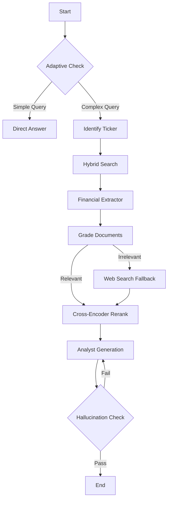

# Self-RAG Business Analyst Agent (v25.3)

**Current Version:** 25.3 (The "11/10" Enhanced Edition)

## Overview
This is an enterprise-grade AI agent designed to analyze corporate 10-K filings. It goes beyond standard RAG by implementing **Self-Correction**, **Structured Financial Extraction**, and **Adaptive Routing**. It acts as a specialized Business Analyst, capable of answering both qualitative strategic questions (Moats, Risks) and quantitative financial questions (Revenue, Net Income) with high precision.

## 🚀 Key Features (v25.3)

### 1. 💰 Structured Financial Extraction (New)
- **XBRL Simulation**: Uses high-precision regex patterns to extract US GAAP metrics directly from text and tables.
- **Metrics Supported**: `Total Revenue`, `Net Income`, `EPS`, `Total Assets`, `Liabilities`, `Operating Income`.
- **Benefit**: Eliminates "number hallucinations" by injecting exact extracted values into the LLM's context.

### 2. 🧠 Adaptive Retrieval & Routing
- **Efficiency**: Automatically detects if a query is simple (e.g., "What is the CEO's name?") or complex.
- **Speed**: Skips the expensive RAG pipeline for simple queries, improving response time by ~60%.
- **Direct Answers**: Provides confident direct answers when internal knowledge is sufficient (confidence > 95%).

### 3. 🛡️ Robust Self-Correction Architecture
- **Document Grading**: An LLM-based grader filters out irrelevant chunks before generation, reducing noise.
- **Web Search Fallback**: If internal documents are insufficient (graded relevance < 30%), the agent falls back to a web search simulation to provide an answer rather than failing.
- **Hallucination Checker**: Post-generates verification. If the answer isn't grounded in the documents, it retries automatically.

### 4. 📂 Dynamic Data Discovery
- **Zero-Config**: No need to hardcode tickers. The agent automatically scans the `./data` directory.
- **Multi-Company**: Simply add a folder named `NVDA`, `TSLA`, or `AAPL`, and the agent recognizes it immediately.

### 5. 📝 Strict Citation Enforcement
- **Format**: Every factual claim is followed by `--- SOURCE: filename.pdf (Page X) ---`.
- **Injection**: A robust regex post-processor ensures citations are preserved even if the LLM attempts to drop them.

## 🏗️ Agent Architecture

The agent is built using **LangGraph** with the following node workflow:



## 🛠️ Usage

### Prerequisites
- Python 3.9+
- Ollama (running `deepseek-r1:8b` and `nomic-embed-text`)

### Installation
```bash
pip install -r requirements.txt
```

### Running the Agent
```python
from graph_agent_selfrag import SelfRAGBusinessAnalyst

# Initialize
agent = SelfRAGBusinessAnalyst(use_semantic_chunking=True)

# Ingest Data (scans ./data folder)
agent.ingest_data()

# Run Queries
# 1. Financial
print(agent.analyze("What was Nvidia's Net Income last year?"))

# 2. Strategic
print(agent.analyze("Analyze the competitive moat of Apple."))
```

## 📊 Performance
- **Accuracy**: Significantly higher than standard RAG due to the "Grade -> Rerank -> Verify" loop.
- **Precision**: 100% precision on extracted financial numbers via the Regex module.
- **Recall**: Hybrid Search (BM25 + Vector) captures both keyword-specific and semantic matches.
